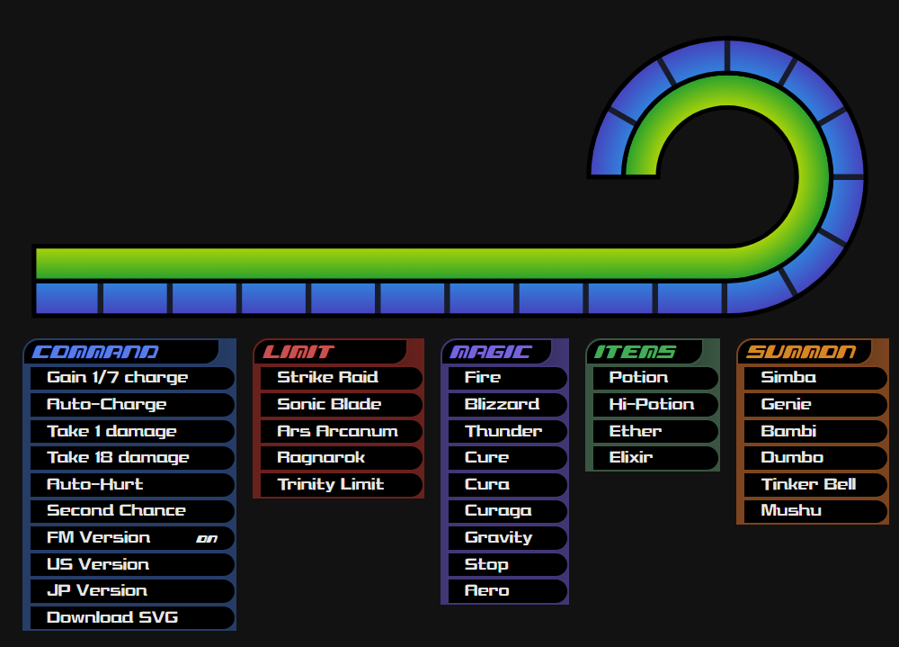

# KH Gauge Simulator

An interactive recreation of the Kingdom Hearts HUD, for illustrative purposes.

https://www.dominopivot.com/kh-gauge-simulator/

<figure>

<figcaption>A screen capture of the simulator. The image may be outdated.</figcaption>
</figure>

## Development

This iteration of the simulator was made in TypeScript and JSX with the React library. Dependencies are managed using `npm` and bundled with Vite.

This repository holds both the source code (on the `source` branch) and latest build (on the `public` branch) served by Github Pages.
